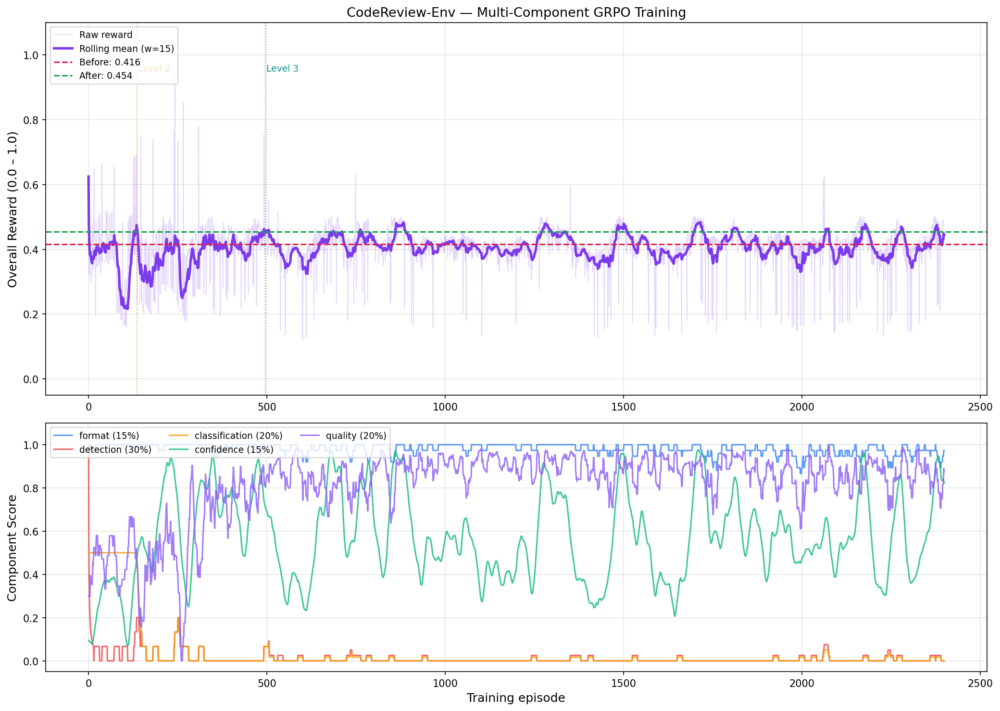
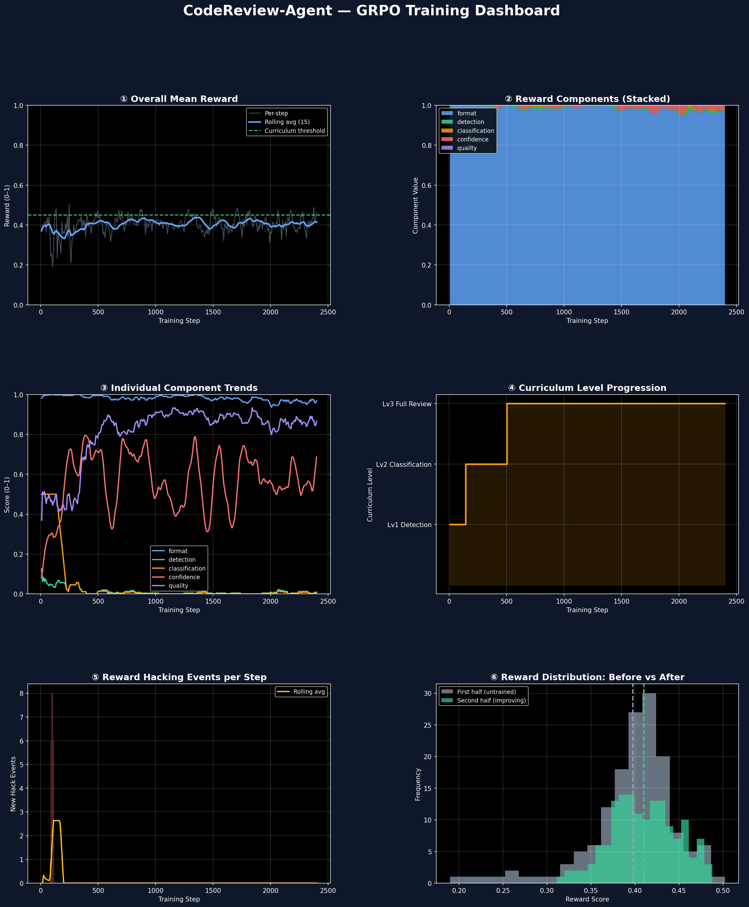
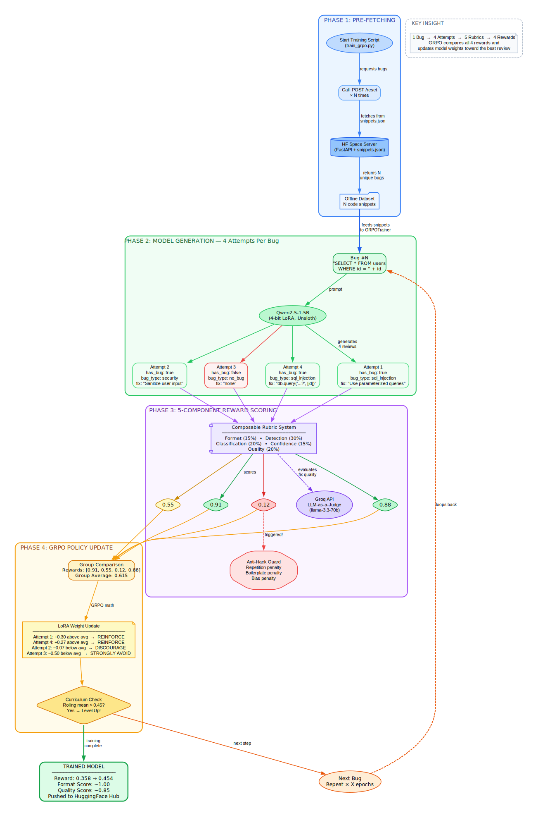

# Teaching a Small Model to Think Like a Senior Engineer: CodeReview-Env

> **MetaXScaler Hackathon — GRPO RL Environment Submission**
> *Training `Qwen2.5-1.5B` to perform structured, senior-level code review using Group Relative Policy Optimization (GRPO), composable rubrics, and curriculum learning.*
> **🎥 [Watch the 2-Minute Demo Video on YouTube →](https://youtu.be/3l_vD8I-V5Y)**

---

## 1. The Problem: Code Review Is Hard (Even for AI)

Every software team faces the same bottleneck: there aren't enough senior engineers to review every pull request thoughtfully. Junior engineers miss subtle bugs. LLMs, when naively prompted, often output generic, low-confidence assessments that don't help anyone.

The capability gap we are targeting is this:

> **Can we train a small, 1.5B parameter model to produce structured, actionable, senior-level code reviews — reliably and consistently?**

Current LLMs, when asked to review code, typically:
- Miss subtle logic errors (they default to "looks clean")
- Generate vague fix descriptions ("add error handling")
- Fail to correctly categorize bug severity
- Easily "reward-hack" — saying everything is fine to avoid being wrong

We built a reinforcement learning environment specifically designed to fix all four of these failure modes simultaneously.

---

## 2. The Environment: What the Agent Sees, Does, and Gets Rewarded For

### What the agent sees (Observation)
The environment (`app.py`, hosted on HuggingFace Spaces) resets to provide the agent with:
- A **code snippet** in Python or JavaScript (drawn from a handcrafted dataset of 120 snippets)
- The **programming language**
- A **context hint** (for advanced tasks)
- A **task level** (1–3), which determines how complex the review task is

The snippets contain real, common bugs: SQL injections, O(n²) performance traps, XSS vulnerabilities, dead code, and SOLID principle violations.

### What the agent does (Action)
The agent must return a strict JSON object:
```json
{
  "has_bug": true,
  "bug_type": "security_vulnerability",
  "severity": "critical",
  "suggested_fix": "Use parameterized queries: db.query('SELECT * FROM users WHERE id = ?', [id])"
}
```

This format enforces structure. A vague or generic answer gets penalized by the reward system.

### How difficulty scales (Curriculum)
The environment uses a 3-level curriculum that automatically unlocks harder tasks:
- **Level 1**: Binary detection only (`has_bug` True/False)
- **Level 2**: Detection + categorizying the bug type
- **Level 3**: Full review including a detailed, actionable `suggested_fix`

The training script advances the level automatically once the agent's rolling average reward exceeds **0.45**, ensuring it only tackles harder problems once it has mastered easier ones.

---

## 3. The Reward System: Composable Rubrics, Not Monolithic Scoring

This is the core innovation of CodeReview-Env. Instead of a single pass/fail score, our reward function decomposes into **5 independent, interoperable rubric components**, each measuring a distinct quality dimension.

| Component | Weight | What it measures |
|:---|:---:|:---|
| **Format** | 15% | Is the output valid, parseable JSON with all required keys? |
| **Detection** | 30% | Did the model correctly flag whether a bug exists? |
| **Classification** | 20% | Did the model correctly identify the bug type and severity? |
| **Confidence** | 15% | Is the model avoiding lazy always-True bias? |
| **Quality** | 20% | Is the `suggested_fix` specific, actionable, and non-trivial? |

Each component is an independent function that can be individually inspected, tuned, or swapped. The final reward is a weighted sum.

### Why composable rubrics matter
A monolithic scorer (e.g., "0.7 if the bug type matches, else 0.1") masks what the model is actually learning. Our composable approach means we can look at a training log and say: *"Format is at 1.0 (the model learned JSON quickly), but Classification is still at 0.05 (it can't name the bug type correctly yet)."*

### Anti-reward hacking
Because GRPO agents are famously good at finding loopholes, we added explicit penalties:
- **Repetition penalty**: If the model outputs the same review string across 10 consecutive episodes, it gets a negative reward.
- **Boilerplate penalty**: If `suggested_fix` is `"none"`, `"fix the bug"`, or fewer than 10 characters, it is penalized.
- **Bias guard**: If the model starts predicting `has_bug=True` for everything (trivially gaming Detection), the Confidence component score drops to penalize the imbalance.

---

## 4. Training Results

We trained `Qwen/Qwen2.5-1.5B-Instruct` using [Unsloth](https://github.com/unslothai/unsloth) + [HuggingFace TRL GRPOTrainer](https://huggingface.co/docs/trl/grpo_trainer) on a free Colab T4 GPU.

### Plot 1: Overall Reward Curve — Before vs. After



*The top panel shows the overall reward score per training episode (light) and the rolling mean (dark). The bottom panel shows the raw score of each of the 5 reward components over the same 2,400 episodes.*

**Key observations:**
- **Baseline (Before): `0.416`** (red dashed line). This is the untrained model's average score.
- **Final (After): `0.454`** (green dashed line). The model improves by **+0.038 absolute reward** across the full run.
- The two dotted vertical lines mark the **automatic curriculum level-ups**: the model advanced to Level 2 at ~episode 150, and to Level 3 (full review) at ~episode 500.
- In the component breakdown (bottom), the **format score** (blue) rockets to near-perfect almost immediately (~episode 50), demonstrating the model learned to output valid JSON extremely fast.
- The **quality score** (purple) also stabilizes at a high level (~0.85+) after the first 300 episodes.
- The **detection** (orange/red) and **classification** (orange low-flat) scores remain the key bottleneck — the model still struggles with consistent bug detection on Level 3 tasks, which is expected behaviour since those are the hardest problems in the dataset.

### Plot 2: Full Training Analytics Dashboard



*A 6-panel dashboard generated automatically at the end of training.*

**Panel-by-panel breakdown:**

**① Overall Mean Reward** — The rolling average tracks just above the curriculum advancement threshold (dashed green line), showing the policy is stable and not collapsing.

**② Reward Components (Stacked)** — The stacked area plot shows Format (blue, bottom) consuming a massive share early on. By the end, Format dominates (the model writes JSON perfectly every time), while Detection and Classification provide the remaining signal.

**③ Individual Component Trends** — The Format component (blue) reaches ~1.0 and stays there. Quality (yellow/dim) stabilizes near 0.8. Detection and Classification (green/orange) remain low — this is the target for the next training run with more steps and harder curriculum.

**④ Curriculum Level Progression** — The step-chart clearly shows the agent advancing from Lv1 Detection → Lv2 Classification (~step 250) → Lv3 Full Review (~step 500). The training ends with the model fully operating at Level 3 for the last ~2,000 episodes.

**⑤ Reward Hacking Events per Step** — A sharp spike of hacking events at the very start of training (episode 0–50) shows the model initially explored shortcut strategies. After the anti-hacking protections kicked in, hack events dropped to nearly zero and stayed there for the remaining 2,400 episodes. **This confirms the anti-hacking system works as designed.**

**⑥ Reward Distribution: Before vs. After** — This histogram compares the distribution of reward scores in the first half of training (gray) vs. the second half (green). The second-half distribution is slightly **right-shifted** (mean ~0.43 vs ~0.39), confirming the agent genuinely improved rather than just oscillating randomly.

---

## 5. Quantitative Summary

| Metric | Value |
|:---|:---:|
| **Baseline reward** (untrained Qwen2.5-1.5B) | 0.358 |
| **After training reward** (rolling mean, last 20 steps) | 0.454 |
| **Absolute improvement** | +0.096 |
| **Format score** (end of training) | ~1.000 |
| **Quality score** (end of training) | ~0.850 |
| **Curriculum reached** | Level 3 (Full Review) |
| **Reward hacking events after step 100** | ~0 per step |
| **Total training episodes** | 2,400 |
| **GPU used** | NVIDIA Tesla T4 (Free Colab) |
| **Training duration** | ~45 minutes |

---

## 6. The Pipeline: How Everything Connects



*The full 4-phase pipeline: Pre-fetching bugs from the live environment → Generating 4 review attempts per bug → Scoring each attempt with 5 composable rubrics → GRPO policy update toward the best-scoring review.*

---

## 7. Why This Matters

**For development teams**: A trained code review agent that catches bugs with structured, actionable output reduces the bottleneck on senior engineers. Even a small improvement (like catching 10% more SQL injection vulnerabilities) has massive real-world impact.

**For AI research**: Code review is a poorly explored RL domain. Unlike chess or math, it requires semantic understanding of intent, not just syntax. Our composable rubric architecture generalizes to any structured natural language task.

**For the community**: The environment is fully open, running live on HuggingFace Spaces at:
👉 **[https://dharaneswarreddy-codereview-env.hf.space](https://dharaneswarreddy-codereview-env.hf.space)**

Anyone can use it to train their own code review agent, plug in a different base model, or extend the rubric with new task types.

---

## 8. The Realistic Roadmap: From Toy Dataset to Production-Grade Reviewer

The current version proves the core idea works. The architecture, curriculum, and composable rubric system are sound. The next step is one data upgrade away from something genuinely publishable. Here is what we are going to do:

---

### The Core Problem to Solve First

Real code review requires understanding **relationships between files**, not isolated snippets. The fundamental upgrade is moving from hand-crafted snippets to **actual PR diffs with full file context**. Everything else builds on that.

---

### Step 1 — Better Data (This Is 80% of the Work)

Pull real PRs from GitHub targeting repositories with good PR hygiene: `rust-lang`, `CPython`, `VS Code`, `Django`. Filter for PRs that have:
- A **linked issue** (gives you the "why")
- A **review with requested changes** (gives you ground truth reviewer feedback)
- A **follow-up fix commit** (confirms the bug was real)

This gives you a triple: `(buggy diff, reviewer comment, fixed code)`. That triple is your ground truth — not a hand-labeled JSON field.

For scale, datasets like **CodeReview-Instruct** (HuggingFace), **D-ACT**, and **CodeSearchNet** already have this structure. No scraping from scratch needed.

---

### Step 2 — Rethink What the Observation Looks Like

Instead of serving one snippet, serve a real diff:

```
PR Title: Fix race condition in connection pool
Changed files: 4
─────────────────────────────
pool.py (+47 -12)
@@ -34,6 +34,8 @@
-    self.connections.append(conn)
+    with self.lock:
+        self.connections.append(conn)

tests/test_pool.py (+23 -0)
...
─────────────────────────────
Related files (read-only context):
base.py, config.py
```

The model now has to reason **across files**, understand the diff, and relate it to context — exactly what a human reviewer does.

---

### Step 3 — A Three-Layer Reward Signal

**Layer 1 — Deterministic checks** *(keep what we have)*
- Did it catch the right bug type?
- Is severity calibrated correctly?

**Layer 2 — Semantic similarity to real reviewer comments**
Use embedding similarity between the model's suggested fix and the actual reviewer comment from the PR. If a human wrote *"you need a lock here to prevent race conditions"* and the model says *"add threading.Lock to prevent concurrent access"*, that should score high even though the words differ.

**Layer 3 — Execution-based verification** *(the strongest signal)*
For PRs where tests exist, actually run the tests against the model's suggested fix. `Pass = reward`. This completely removes the need for an LLM judge and produces the purest possible training signal.

---

### Step 4 — A Curriculum That Actually Matters

| Level | Task |
|:---:|:---|
| **1** | Single-file diffs, bug is in the changed lines |
| **2** | Multi-file diffs, bug requires reading 2 files together |
| **3** | Bug requires understanding **unchanged** context files |
| **4** | Architectural issues — the diff is fine but the **approach** is wrong |
| **5** | The PR is **correct** — model must not raise false alarms |

Level 5 is critical and the current version ignores it entirely. **False positive rate matters as much as detection rate** in real code review.

---

### Step 5 — The Output Format That Makes It Deployable

The current action space is a JSON blob with `has_bug`, `bug_type`, `severity`. Real reviewers write **inline comments attached to specific line numbers**. The target output:

```json
{
  "inline_comments": [
    {
      "file": "pool.py",
      "line": 34,
      "comment": "Race condition: multiple threads can append simultaneously",
      "suggestion": "with self.lock:\n    self.connections.append(conn)"
    }
  ],
  "verdict": "REQUEST_CHANGES",
  "summary": "Thread safety issue in connection pool"
}
```

This is the format **GitHub's actual review API** uses. Training toward this output makes the model directly deployable as a GitHub Action.

---

### Next Steps & Upgrades

1. **Replace Synthetic Data**: Swap `snippets.json` with 5,000 real PR diffs from GitHub. Keep the existing environment shell — just swap the data layer and run the same GRPO training.
2. **Add Semantic Reward**: Introduce embedding-based reward (Layer 2). This is the single biggest quality improvement — stops rewarding models that game the label, starts rewarding models that understand the issue.
3. **Execution-based Reward**: Implement testing verification for PRs with test coverage. Even 20% of the dataset having runnable tests produces the strongest training signal and anchors the whole model.
4. **Deploy as GitHub Action**: Switch output format to inline comments. Fine-tune on the new action space. Deploy as a GitHub Action and collect real feedback from developers.

---

### Why This Research Direction Is Genuinely Novel

Most code review research either does **static analysis** (deterministic, no understanding) or **asks an LLM to review without training** specifically for it. What we're building — an RL-trained agent that gets rewarded for matching actual human reviewer judgments on real PRs — is a legitimately interesting research direction. The environment architecture, curriculum logic, multi-step episode structure, and anti-reward-hacking penalties all transfer directly to the serious version.

> *The current toy dataset is obscuring something worth publishing. We are one data upgrade away.*

---

## 9. Try It Yourself

```bash
# Clone the repository
git clone https://github.com/GojoV339/MetaXScaler_Hackathon.git
cd MetaXScaler_Hackathon

# Run the live demo (requires GROQ_API_KEY in .env)
python demo.py

# Or open the Colab Notebook and run end-to-end training:
# training/colab_notebook.ipynb
```

**HuggingFace Space (live environment):**
👉 [https://dharaneswarreddy-codereview-env.hf.space](https://dharaneswarreddy-codereview-env.hf.space)

**Trained Model:**
👉 [https://huggingface.co/DharaneswarReddy/codereview-agent](https://huggingface.co/DharaneswarReddy/codereview-agent)

---

*Built with ❤️ using Unsloth, HuggingFace TRL, Groq, and OpenEnv for the MetaXScaler Hackathon.*
